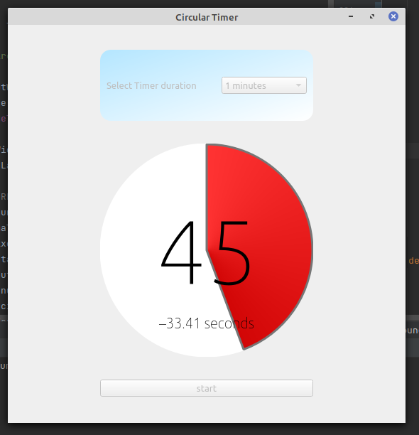

# Countdown Timer
A modern looking timer built with PyQt5, for the purpose of taking countdown.

<br>
<br>
<hr>

### CHECK LISTS BEFORE YOU CAN LAUNCH THE APPLICATION:
- ### Python Version >= 3.7

- ### Installation Required
    - PyQt5

Navigate to [Source Code Directory](./PyQt5_SourceCode), and run the following command from terminal:
```bash
$ python main.py
```

<hr>

<p align="center"><h2>Python_Timer <u><a href="images/">Preview</a></u>:</h2></p>

<p align="center">
    
    <br>
    <u>As It Looks Now</u>
</p>

<hr>

## Features 
- Can set timer run duration from select choices.
- Soothing view of timer animation.
- cross platform

<br>
<hr>
<p align="center">``END``</p>
<hr>